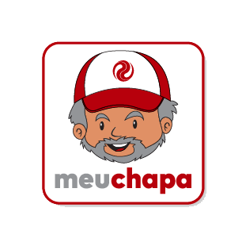

# meuchapa

  
  

  

   O Meu Chapa é um aplicativo que cria um companheiro de viagem para o caminhoneiro, estimulando-o a cuidar da sua saúde física e mental, por meio da gamificação.
  

  

   Projeto foi desenvolvido no <b>Hackthon CCR</b> - Time 373
  

  

<h3 align="center">
  <b>Links</b>
</h3>

  <a href="https://www.youtube.com/watch?v=UoUB45ikNcY"> Pitch Meu Chapa - Hackathon CCR
  

  <a href="https://meuchapa-d39a9.web.app/"> Site - Meu Chapa (by Cleanderson Lobo)
  

  <a href="https://github.com/rsn86/meuchapa"> App Flutter - Meu Chapa (by Rodrigo Schmidt)
  

## Tecnologias

- React
- TypeScript
- Bootstrap
- Firebase
- Styled-Components

## Author

[Cleanderson Lobo](https://www.linkedin.com/in/cleandersonlobo/)